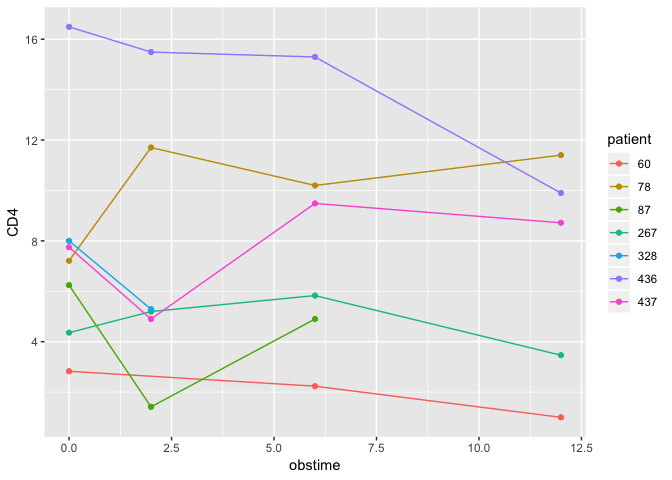
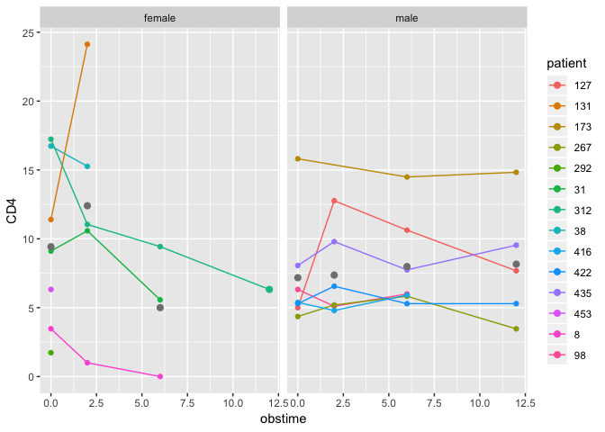
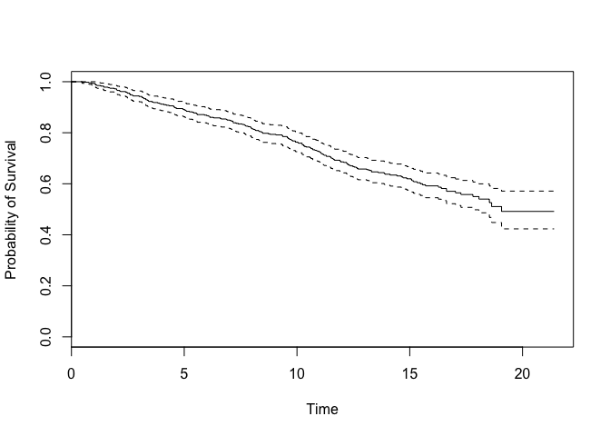

Exploring the `aids` Dataset
================
Shuxian Fan
Sep 8, 2018

Data Description
----------------

The dataset used on this page is available in **R** as a data frame `aids` in the package **JM**. The dataset `aids` has 1408 observations measured with 9 variables shown as following:

<table style="width:82%;">
<colgroup>
<col width="15%" />
<col width="66%" />
</colgroup>
<thead>
<tr class="header">
<th>Variables</th>
<th align="left">Description</th>
</tr>
</thead>
<tbody>
<tr class="odd">
<td><code>patient</code></td>
<td align="left">patients identifier</td>
</tr>
<tr class="even">
<td><code>Time</code></td>
<td align="left">time to death or censoring</td>
</tr>
<tr class="odd">
<td><code>death</code></td>
<td align="left">a binary numerical variable with 0 denoting censoring and 1 death</td>
</tr>
<tr class="even">
<td><code>CD4</code></td>
<td align="left">count of the CD4 cells</td>
</tr>
<tr class="odd">
<td><code>obstime</code></td>
<td align="left">time at which CD4 cells count was recorded</td>
</tr>
<tr class="even">
<td><code>drug</code></td>
<td align="left">a factor with levels <code>ddC</code> denoting zalcitabine and <code>ddI</code> denoting didanosine</td>
</tr>
<tr class="odd">
<td><code>gender</code></td>
<td align="left">a factor with levels <code>female</code> and <code>male</code></td>
</tr>
<tr class="even">
<td><code>prevOI</code></td>
<td align="left">a factor with levels <code>AIDS</code> denoting previous AIDS diagnosis at study entry, and <code>noAIDS</code> denoting no previous infection.</td>
</tr>
<tr class="odd">
<td><code>AZT</code></td>
<td align="left">a factor with levels <code>intolerance</code> and <code>failure</code> denoting AZT intolerance and AZT failure</td>
</tr>
</tbody>
</table>

The corresponding dataset `aids.id` contains the first CD4 cell count for each patient. This dataset is used for survival analysis.

### *Long* Format of the Data

The *long* format of the data requires the measurements of each subject are stored in multiple rows. It is in the contrast to the *wide* format where the measurements of each subject are stored in multiple columns. Here we would like to check if the dataset is already shaped in this format.

``` r
# Load the package.
library(JM)
# Load the datasets
data("aids", package = "JM")
data("aids.id", package = "JM")
```

``` r
# Extract observations from patients id 1 to 3 with only variables: 
# "patient", "CD4", "obstime", "gender".
aids[aids$patient %in% c(1,2,3), c("patient", "CD4", "obstime", "gender")]
```

    ##    patient       CD4 obstime gender
    ## 1        1 10.677078       0   male
    ## 2        1  8.426150       6   male
    ## 3        1  9.433981      12   male
    ## 4        2  6.324555       0   male
    ## 5        2  8.124038       6   male
    ## 6        2  4.582576      12   male
    ## 7        2  5.000000      18   male
    ## 8        3  3.464102       0 female
    ## 9        3  3.605551       2 female
    ## 10       3  6.164414       6 female

The measurements for the patients with id 1,2,3 are stored in the first 10 rows of the dataset, which agrees with the long format requirement.

``` r
head(aids)
```

    ##   patient  Time death       CD4 obstime drug gender prevOI         AZT
    ## 1       1 16.97     0 10.677078       0  ddC   male   AIDS intolerance
    ## 2       1 16.97     0  8.426150       6  ddC   male   AIDS intolerance
    ## 3       1 16.97     0  9.433981      12  ddC   male   AIDS intolerance
    ## 4       2 19.00     0  6.324555       0  ddI   male noAIDS intolerance
    ## 5       2 19.00     0  8.124038       6  ddI   male noAIDS intolerance
    ## 6       2 19.00     0  4.582576      12  ddI   male noAIDS intolerance
    ##   start  stop event
    ## 1     0  6.00     0
    ## 2     6 12.00     0
    ## 3    12 16.97     0
    ## 4     0  6.00     0
    ## 5     6 12.00     0
    ## 6    12 18.00     0

``` r
ncol(aids)
```

    ## [1] 12

``` r
str(aids)
```

    ## 'data.frame':    1405 obs. of  12 variables:
    ##  $ patient: Factor w/ 467 levels "1","2","3","4",..: 1 1 1 2 2 2 2 3 3 3 ...
    ##  $ Time   : num  17 17 17 19 19 ...
    ##  $ death  : int  0 0 0 0 0 0 0 1 1 1 ...
    ##  $ CD4    : num  10.68 8.43 9.43 6.32 8.12 ...
    ##  $ obstime: int  0 6 12 0 6 12 18 0 2 6 ...
    ##  $ drug   : Factor w/ 2 levels "ddC","ddI": 1 1 1 2 2 2 2 2 2 2 ...
    ##  $ gender : Factor w/ 2 levels "female","male": 2 2 2 2 2 2 2 1 1 1 ...
    ##  $ prevOI : Factor w/ 2 levels "noAIDS","AIDS": 2 2 2 1 1 1 1 2 2 2 ...
    ##  $ AZT    : Factor w/ 2 levels "intolerance",..: 1 1 1 1 1 1 1 1 1 1 ...
    ##  $ start  : int  0 6 12 0 6 12 18 0 2 6 ...
    ##  $ stop   : num  6 12 17 6 12 ...
    ##  $ event  : num  0 0 0 0 0 0 0 0 0 1 ...

### Summary Statistics

``` r
# Show the summary of the dataset `aid.id`
summary(aids.id)
```

    ##     patient         Time           death             CD4        
    ##  1      :  1   Min.   : 0.47   Min.   :0.0000   Min.   : 0.000  
    ##  2      :  1   1st Qu.:10.23   1st Qu.:0.0000   1st Qu.: 3.317  
    ##  3      :  1   Median :13.20   Median :0.0000   Median : 6.083  
    ##  4      :  1   Mean   :12.63   Mean   :0.4026   Mean   : 7.129  
    ##  5      :  1   3rd Qu.:16.23   3rd Qu.:1.0000   3rd Qu.:10.440  
    ##  6      :  1   Max.   :21.40   Max.   :1.0000   Max.   :19.235  
    ##  (Other):461                                                    
    ##     obstime   drug        gender       prevOI             AZT     
    ##  Min.   :0   ddC:237   female: 45   noAIDS:160   intolerance:292  
    ##  1st Qu.:0   ddI:230   male  :422   AIDS  :307   failure    :175  
    ##  Median :0                                                        
    ##  Mean   :0                                                        
    ##  3rd Qu.:0                                                        
    ##  Max.   :0                                                        
    ##                                                                   
    ##      start        stop            event       
    ##  Min.   :0   Min.   : 0.470   Min.   :0.0000  
    ##  1st Qu.:0   1st Qu.: 2.000   1st Qu.:0.0000  
    ##  Median :0   Median : 2.000   Median :0.0000  
    ##  Mean   :0   Mean   : 2.856   Mean   :0.1049  
    ##  3rd Qu.:0   3rd Qu.: 2.000   3rd Qu.:0.0000  
    ##  Max.   :0   Max.   :19.570   Max.   :1.0000  
    ## 

The aids dataset has 467 unique patients, among which 45 are females, 422 are males. By the end of the study, there are in total 188 patients had died, giving a 40.26% death rate.

Data Exploration
----------------

### Longitudinal Submodel

Longitudinal data are usually fit using a mixed effects model. To determine the appropriate model used for the dataset, we would like to check the longitudinal trajectories for the longitudinal measurements. Here we pick a random group of 7 people, of which the CD4 cells counts are plot against the Time.

``` r
# Randomly chose 8 patients' ids from the patient list.
set.seed(2)
index.spl = sample(aids.id$patient, 7)
# Extract the random sample from the dataset.
aids.spl1 = subset(aids, aids$patient %in% index.spl)

# Load ggplot2 package
require(ggplot2)
# Define base for the plot
b = ggplot(data = aids.spl1, aes(x = obstime, y = CD4, group = patient, color = patient))
# Plotting the trajectories
b+geom_line()+geom_point()
```



Based on the longitudinal trajectories, it is reasonable to consider a linear mixed effects model with random effects term in the intercept.

``` r
# install.packages(nlme)
library(nlme)
lmeFit = lme(CD4~obstime, random = ~1|patient, data = aids)
summary(lmeFit)
```

    ## Linear mixed-effects model fit by REML
    ##  Data: aids 
    ##        AIC      BIC    logLik
    ##   7176.633 7197.618 -3584.316
    ## 
    ## Random effects:
    ##  Formula: ~1 | patient
    ##         (Intercept) Residual
    ## StdDev:    4.506494 1.961662
    ## 
    ## Fixed effects: CD4 ~ obstime 
    ##                 Value  Std.Error  DF   t-value p-value
    ## (Intercept)  7.188663 0.22061320 937  32.58492       0
    ## obstime     -0.148500 0.01218699 937 -12.18513       0
    ##  Correlation: 
    ##         (Intr)
    ## obstime -0.194
    ## 
    ## Standardized Within-Group Residuals:
    ##         Min          Q1         Med          Q3         Max 
    ## -3.84004681 -0.44310988 -0.05388055  0.43593364  6.09265321 
    ## 
    ## Number of Observations: 1405
    ## Number of Groups: 467

This model fit corresponds to a simple linear mixed effect model assuming a random effect term in the intercept for each patient:
*y*<sub>*i**j*</sub> = *β*<sub>0</sub> + *β*<sub>1</sub>*t*<sub>*i**j*</sub> + *b*<sub>*i*</sub> + *ϵ*<sub>*i**j*</sub>
 where *b*<sub>*i*</sub> and *ϵ*<sub>*i**j*</sub> are assumed to follow normal distributions.

Furthermore, we could compare the mean CD4 counts between genders. This will probably help us on answering the question that if the CD4 counts over time depend on whether a patient is female or male. Here we use 14 randomely chosen patients to illustrate the comparison.

``` r
# Get the 14 randomly selected sample.
set.seed(1)
males = aids.id[aids.id$gender=="male",]
females = aids.id[aids.id$gender!="male",]
male.id = sample(males$patient, 7)
female.id = sample(females$patient, 7)

# Extract the random sample from the dataset.
aids.spl2 = subset(aids, aids$patient %in% c(male.id, female.id))
# Define base for the plot
p = ggplot(data = aids.spl2, aes(x = obstime, y = CD4, group = patient, color = patient))
# Plot the Trajectories for each patients and adding the overall mean point.
p+geom_line()+geom_point() + stat_summary(aes(group = 1), geom = "point", fun.y = mean,
    shape = 16, size = 2.5)+facet_grid(.~gender)
```



### Survival Submodel

The survival data are characterized by the response variable being the time until the event(For example, death). Here for simplicity, we just illustrate the Kaplan-Meier estimate of the survival function for the `aids.id` dataset.

``` r
# Create and plot the Kaplan-Meier estimate
km = survfit(Surv(Time, death)~1, data = aids.id)
plot(km, xlab = "Time", ylab = "Probability of Survival")
```



### Joint Modelling

In order to answer the question:

**Whether there is any association between the longitudinal process and the hazard of death?**

We are interested in jointly fitting the longitudinal and survival submodels.

``` r
# install.packages("survival")
library(JM)
library(nlme)
library(survival)

# Joint model fit 
lmeFit = lme(CD4~obstime, random = ~1|patient, data = aids)
coxFit = coxph(Surv(Time,death)~1, data = aids.id, x = T)
jointFit = jointModel(lmeFit,coxFit, timeVar = "obstime", method = "piecewise-PH-aGH")
summary(jointFit)
```

    ## 
    ## Call:
    ## jointModel(lmeObject = lmeFit, survObject = coxFit, timeVar = "obstime", 
    ##     method = "piecewise-PH-aGH")
    ## 
    ## Data Descriptives:
    ## Longitudinal Process     Event Process
    ## Number of Observations: 1405 Number of Events: 188 (40.3%)
    ## Number of Groups: 467
    ## 
    ## Joint Model Summary:
    ## Longitudinal Process: Linear mixed-effects model
    ## Event Process: Relative risk model with piecewise-constant
    ##      baseline risk function
    ## Parameterization: Time-dependent 
    ## 
    ##    log.Lik      AIC      BIC
    ##  -4354.494 8732.988 8782.744
    ## 
    ## Variance Components:
    ##               StdDev
    ## (Intercept) 4.548927
    ## Residual    1.956770
    ## 
    ## Coefficients:
    ## Longitudinal Process
    ##               Value Std.Err  z-value p-value
    ## (Intercept)  7.1865  0.2224  32.3158 <0.0001
    ## obstime     -0.1637  0.0122 -13.3942 <0.0001
    ## 
    ## Event Process
    ##             Value Std.Err  z-value p-value
    ## Assoct    -0.2582  0.0318  -8.1120 <0.0001
    ## log(xi.1) -2.4510  0.1709 -14.3393        
    ## log(xi.2) -2.1270  0.1638 -12.9869        
    ## log(xi.3) -1.7936  0.2298  -7.8050        
    ## log(xi.4) -2.3315  0.3338  -6.9849        
    ## log(xi.5) -2.2403  0.3065  -7.3103        
    ## log(xi.6) -2.2391  0.3902  -5.7378        
    ## log(xi.7) -2.2348  0.5101  -4.3809        
    ## 
    ## Integration:
    ## method: (pseudo) adaptive Gauss-Hermite
    ## quadrature points: 5 
    ## 
    ## Optimization:
    ## Convergence: 0

The parameter of interest in the output of the joint model fitting is labeled `Assoct`. The output of the joint model indicates a strong association between the CD4 measurements and the risk of death.

Source and References
---------------------

<http://www.biostat.umn.edu/~brad/data.html>

<http://www.biostat.umn.edu/~brad/software.html>

<https://stats.idre.ucla.edu/r/faq/how-can-i-visualize-longitudinal-data-in-ggplot2/>
